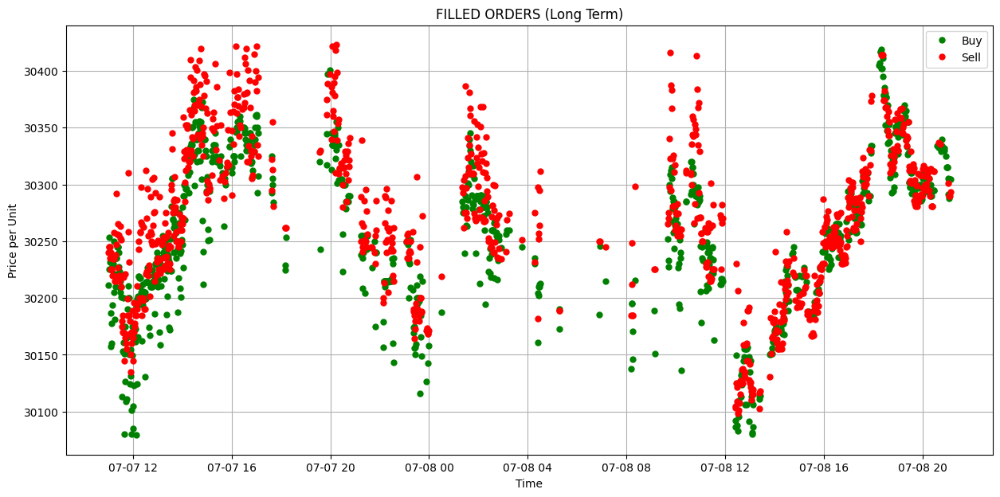
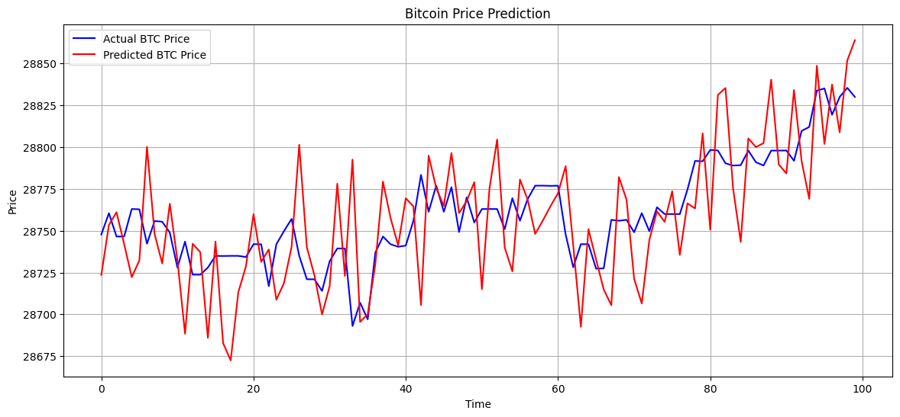
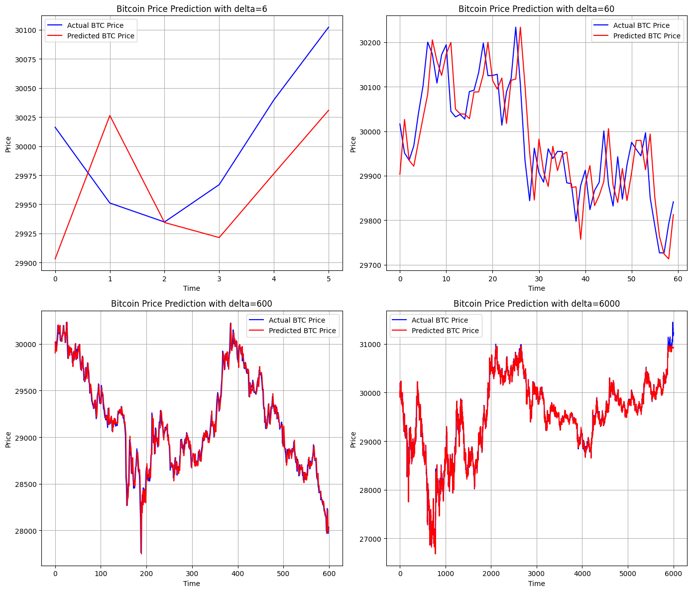
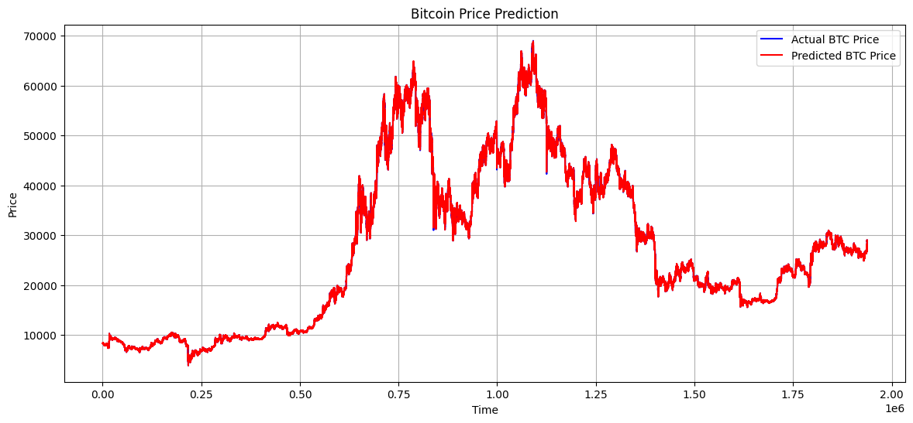

# Trading-Software

# Data
 - BTC, USDT (1:1 with USD)
 - 6 years of one-every-minute datapoints from Binance
 - Each datapoint contains high, low, open, close, volumn
 - Each X consists of 10 minute datapoints
 - Each y is the close price of the next minute

# Model
- Linear layers + nn.transformer + linear layers

# Training
- Data is split into first 80\% training, last 20\% validation and test, no shuffling
- Batch size 128, learning rate 0.005
- Every 5 epochs, evaluate with validation set and save current best model weights, test at the end
  
# Execution
- Pull real time data every seconds (empirically found that per minute data changes within a minute)
- Do inference on most recent 10 minutes data
- If next minute predicted price is profitable (after commision fee), buy/sell part of account balance (1\%)
