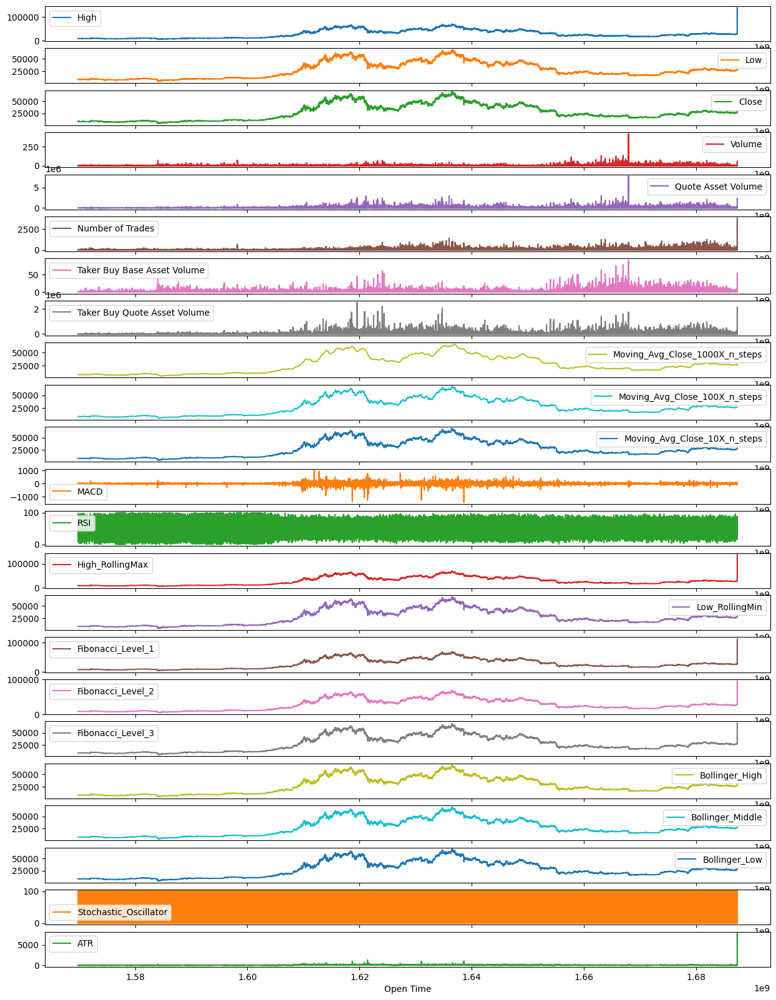
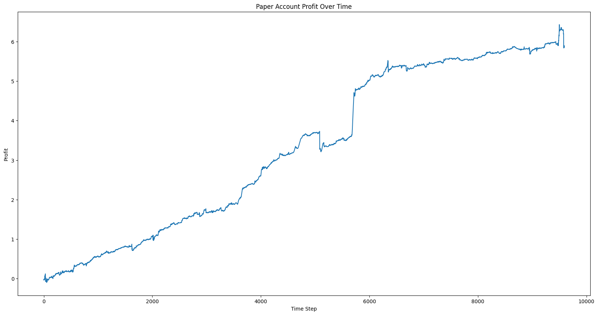
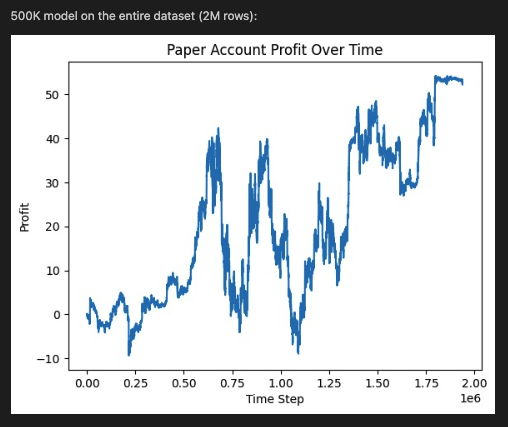
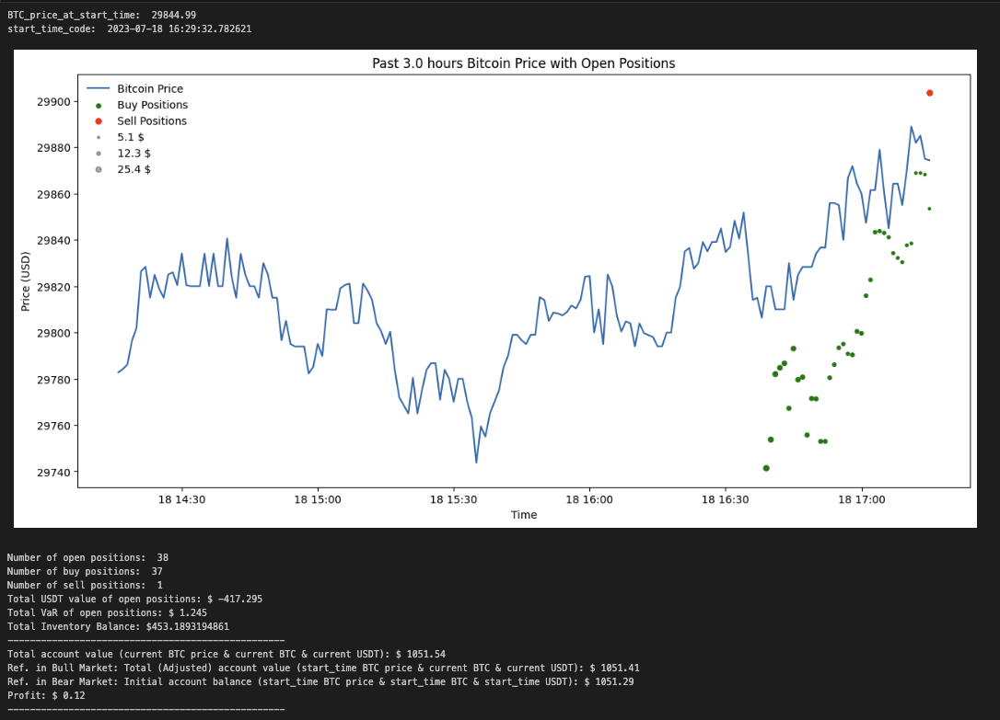
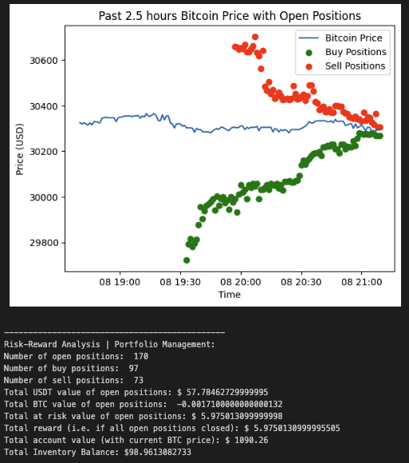

# Trading-Software

* **Main components of the system:**

* **Examples of technical trading indicators:**

* **Example of modeling result different time frames:**

* **Result of trading simulation:**

* **Examples of GUI for history of orders (all orders and filled orders here):**

* **Example of GUI for live trading:**

# Data

- BTC, USDT (1:1 with USD)
- 6 years of one-every-minute datapoints from Binance
- Each datapoint contains high, low, open, close, volumn
- Each X consists of 10 minute datapoints
- Each y is the close price of the next minute

# Model

- Linear layers + nn.transformer + linear layers
- Gradient Boosting
- LSTM

# Training

- Data is split into first 80\% training, last 20\% validation and test, no shuffling
- Batch size 128, learning rate 0.005
- Every 5 epochs, evaluate with validation set and save current best model weights, test at the end

# Execution

- Pull real time data every seconds (empirically found that per minute data changes within a minute)
- Do inference on most recent 10 minutes data
- If next minute predicted price is profitable (after commision fee), buy/sell part of account balance (1\%)
